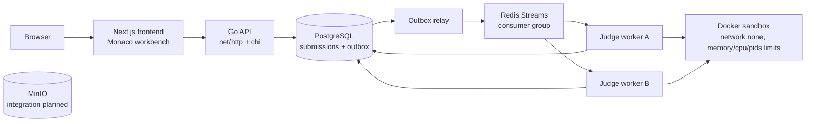
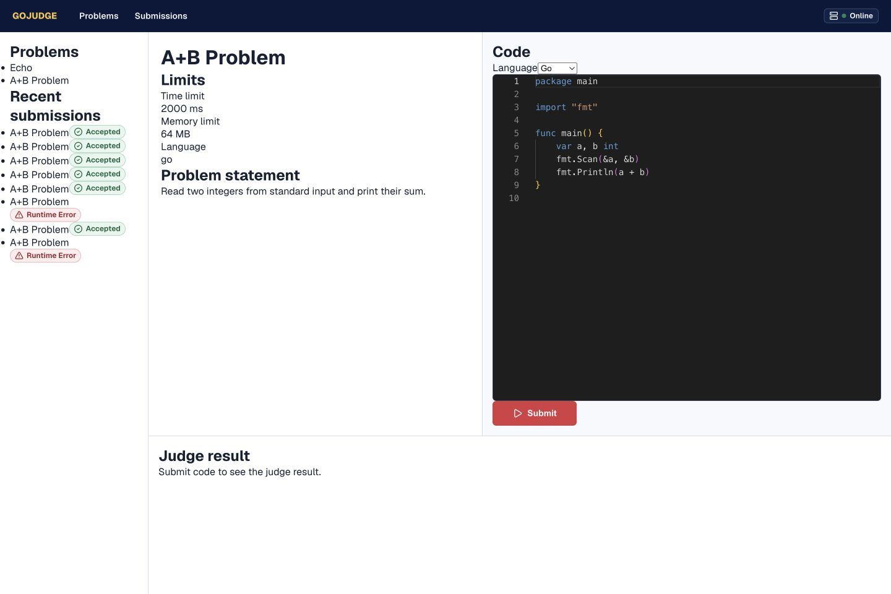
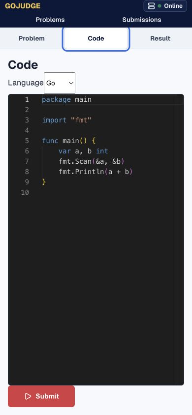

# GoJudge

GoJudge 是一个后端主导的在线代码评测系统。项目核心围绕一句话：Web 后端只是外壳，真正的难点是安全地运行不可信代码。

当前仓库实现了完整 MVP 主链路：浏览题目、Monaco 编辑代码、提交 Go/C++/Python、异步判题、轮询结果和查看提交历史。Compose 环境包含 Next.js 前端、Go API、独立 judge worker、PostgreSQL、Redis Streams 和 MinIO；Redis 消费支持成功后确认、三次重试、死信流和 pending 回收。无外部服务的本地测试默认使用内存 store 和内存 queue。

## Target Stack

```text
Backend: Go + chi
Database: PostgreSQL + pgx
Migration: versioned SQL files
Queue: Redis Streams
Sandbox: Docker
Worker: Go judge-worker
Storage: MinIO service included; test-case integration planned
Frontend: Next.js + React + Monaco Editor
Deploy: Docker Compose
CI/CD: GitHub Actions
Docs: OpenAPI
Observability: slog; Prometheus metrics planned
```

单元测试和只读写 API 演示可以使用内存 store；跨进程判题要求同时设置 `DATABASE_URL` 和 `REDIS_ADDR`。只配置其中一项会启动失败，避免产生不完整的持久化链路。

## Architecture



前端只通过 API 创建和查询提交；API 在一个 PostgreSQL 事务中保存 submission 和 outbox 事件，relay 负责可靠发布到 Redis，但不消费任务。多个 worker 直接通过同一 Consumer Group 抢任务，Docker 沙箱只在 worker 中执行。PostgreSQL 租约和 fencing token 决定最终写权限，避免重复消息或旧 worker 的迟到结果覆盖新结果。

## Quick Start

本地测试：

```bash
make test
```

启动完整 Compose 栈：

```bash
make compose-up
```

`make compose-up` 会先检查并拉取 Go、Python 和 GCC 判题镜像，避免首次判题时把镜像下载时间计入运行时限。若直接使用 `docker compose up -d --build`，请先执行 `make judge-images`。

Compose 暴露的开发端口：

- Frontend: `3000`
- API: `18080`
- PostgreSQL: `15432`
- Redis: `16379`
- MinIO API: `19000`
- MinIO Console: `19001`

环境变量示例见 [.env.example](.env.example)。

健康检查：

```bash
curl http://localhost:3000/
curl http://localhost:18080/healthz
```

浏览器打开 `http://localhost:3000`。主页会进入首个题目工作台：

1. 从左侧题目栏选择 `A+B Problem`。
2. 在 Code 面板选择 Go、C++ 或 Python。
3. 编辑代码并点击 Submit。
4. 在 Result 面板观察 Queued、Running 和终态结果。
5. 打开 Submissions 查看提交历史。

横向扩展 worker：

```bash
docker compose up -d --scale worker=3
```

已有 PostgreSQL 数据卷升级一次：

```bash
make migrate-reliable-workers
```

## Frontend

前端采用竞赛工作台方向，而不是营销式落地页。桌面端使用题目导航、题面/结果和代码编辑器分栏；窄屏使用 Problem、Code、Result 三个标签页。界面使用深海军蓝顶栏、黄色品牌强调、红色主操作和语义化状态色，优先保证信息密度、扫描效率和重复提交体验。

Desktop:



Mobile:



## Compose Services

| Service | Responsibility |
| --- | --- |
| `frontend` | Next.js standalone app and same-origin API proxy |
| `api` | Problem/submission API and transactional outbox relay |
| `worker` | Redis consumer, PostgreSQL lease owner and isolated Docker runner |
| `postgres` | Problems, test cases, submissions and results |
| `redis` | Redis Streams judge queue |
| `minio` | Object storage service; test-case integration remains planned |

## API Examples

列出题目：

```bash
curl http://localhost:18080/problems
```

查看题目详情：

```bash
curl http://localhost:18080/problems/sum
```

提交 Go 代码：

```bash
curl -X POST http://localhost:18080/submissions \
  -H 'Content-Type: application/json' \
  -d '{
    "problemId": "sum",
    "language": "go",
    "code": "package main\nimport \"fmt\"\nfunc main(){var a,b int; fmt.Scan(&a,&b); fmt.Println(a+b)}"
  }'
```

提交 C++ 或 Python 时，`language` 可传 `cpp` 或 `python`。worker 默认按语言选择 Docker 镜像；只有显式配置 `JUDGE_IMAGE` 时才会覆盖默认镜像。

查询提交：

```bash
curl http://localhost:18080/submissions/sub-1
```

查询提交记录：

```bash
curl http://localhost:18080/submissions
```

可能状态：

- `queued`
- `running`
- `accepted`
- `wrong_answer`
- `runtime_error`
- `time_limit_exceeded`
- `internal_error`

## Sandbox

worker 通过 Docker CLI 启动一次性容器执行用户代码，核心限制包括：

- `--network none`
- `--memory 64m`
- `--cpus 1`
- `--pids-limit 64`
- `--read-only`
- `--cap-drop ALL`
- `--security-opt no-new-privileges`
- `--tmpfs /tmp:rw,noexec,nosuid,size=64m`
- stdout 和 stderr 分别最多捕获 1 MiB

Compose 中 worker 挂载 Docker socket 和 `/tmp/codingjudge-sandbox`。这个目录需要和宿主机路径一致，因为 Docker daemon 挂载的是宿主机路径。

Go 和 C++ 使用独立编译容器，编译上限为 10 秒和 512 MiB；编译成功后，测试用例共享同一产物，并分别在只读运行容器中执行。题目的 CPU、内存和时间限制只约束运行阶段，避免把编译开销误判为超时。

当前默认语言镜像：

- Go: `golang:1.25-alpine`
- C++: `gcc:13`
- Python: `python:3.12-alpine`

## Queue Reliability

Redis Streams 使用 consumer group `judge-workers`。每个 worker slot 是独立 consumer，只有带有效 PostgreSQL 租约和 fencing token 的 worker 才能写结果，结果提交成功后才执行 `XACK`。基础设施错误最多重试三次，之后写入 `judge:submissions:dead` 并把 submission 更新为 `internal_error`；空闲 Pending 消息通过 `XAUTOCLAIM` 接管。

系统提供 at-least-once 投递和幂等效果，而不宣称 exactly-once。API 使用 Transactional Outbox 消除 PostgreSQL/Redis 双写丢失窗口；重复 outbox 发布、ACK 前崩溃和 worker 迟到结果都由租约状态机安全处理。

查看死信和 pending：

```bash
docker compose exec redis redis-cli XREVRANGE judge:submissions:dead + - COUNT 10
docker compose exec redis redis-cli XPENDING judge:submissions judge-workers
```

## Verification

后端单元测试、竞态检查和静态分析：

```bash
make test
GOCACHE=$PWD/.cache/go-build go test -race ./...
GOCACHE=$PWD/.cache/go-build go vet ./...
```

前端静态检查、单元测试和生产构建：

```bash
cd frontend
npm ci
npm run lint
npm run typecheck
npm run test:run
npm run build
```

完整浏览器判题与响应式测试需要 Compose 栈：

```bash
make judge-images
docker compose up -d --build
cd frontend
npx playwright install chromium
npm run test:e2e
```

## Project Structure

```text
cmd/api/              API service entrypoint
cmd/worker/           isolated judge worker entrypoint
frontend/             Next.js app, Monaco workbench, unit and Playwright tests
internal/domain/      shared domain models
internal/httpapi/     net/http JSON API
internal/store/       in-memory and PostgreSQL problem/submission stores
internal/queue/       in-memory and reliable Redis Streams queues
internal/outbox/      transactional outbox relay
internal/judge/       judge service and Docker runner
internal/judgeworker/ worker leases, heartbeat, retries and concurrency
migrations/           PostgreSQL schema and seed data
docs/openapi.yaml     API contract draft
docs/plan.md          MVP plan
docs/screenshots/     desktop and mobile product screenshots
```

## Roadmap

1. 已完成：Go API、PostgreSQL、Redis Streams、独立 worker、Docker sandbox、Go/C++/Python 和提交记录。
2. 已完成：成功后确认、重试、死信流、pending recovery、编译/运行分离和输出上限。
3. 已完成：Next.js + Monaco 分栏工作台、状态轮询、提交历史、响应式布局和 Playwright E2E。
4. 已完成：Transactional Outbox、多 worker 直接消费、PostgreSQL 租约、fencing token 和故障接管。
5. 下一阶段：Prometheus、压力测试、登录、比赛、排行榜、管理后台和 MinIO 测试用例集成。

## Resume Highlights

- 设计了 API 与判题 worker 隔离的异步评测链路，避免 API 服务直接执行用户代码。
- 使用 Docker sandbox 对用户代码执行施加网络、内存、CPU、进程数、只读文件系统和 Linux capability 限制。
- 使用 Go + chi 实现轻量 REST API，核心逻辑通过 Go testing 覆盖。
- 支持 PostgreSQL store 与 Redis Streams queue，同时保留内存实现用于快速测试和本地开发。
- 通过延迟 `XACK`、三次重试、死信流和 `XAUTOCLAIM` 实现至少一次任务处理与故障恢复。
- 使用 Transactional Outbox 解决 PostgreSQL 与 Redis 双写一致性，并通过租约与 fencing token 拒绝重复执行的迟到结果。
- 将 Redis Consumer Group 下沉到 judge worker，支持 `docker compose --scale worker=N` 横向扩展。
- 使用 Next.js + Monaco 构建桌面分栏、移动标签式判题工作台，并以 Playwright 覆盖 Go/C++/Python 浏览器端到端流程。
