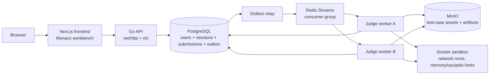
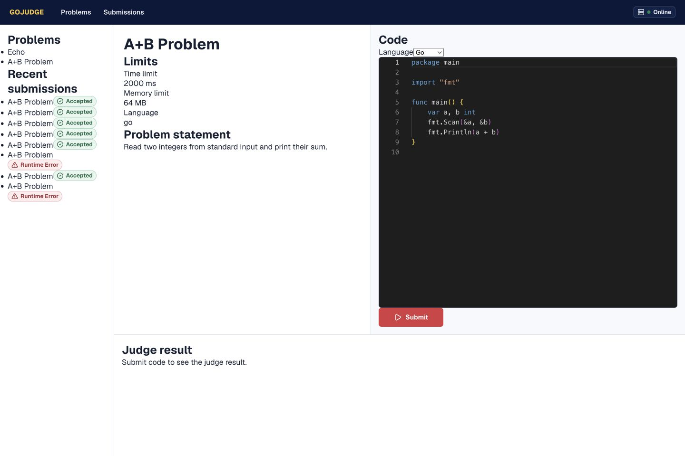
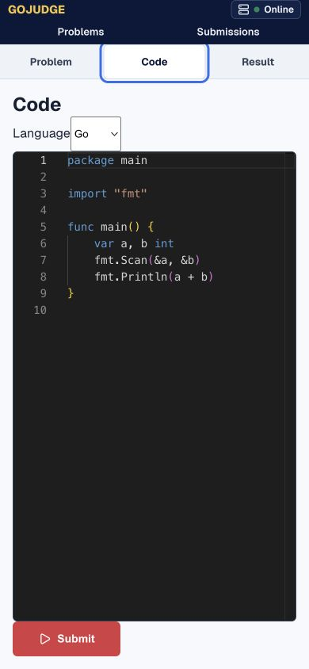

# GoJudge

[](https://github.com/kaii9/codingJudge/actions/workflows/ci.yml)

GoJudge 是一个后端主导的在线代码评测系统。项目核心围绕一句话：Web 后端只是外壳，真正的难点是安全地运行不可信代码。

当前仓库实现了完整 MVP 主链路：用户注册登录、浏览题目、Monaco 编辑代码、提交 Go/C++/Python、异步判题、轮询结果、查看个人提交历史和全站排行榜。题库包含 20 道原创面试高频题和 2 道 Starter 题，覆盖数组、哈希、滑动窗口、链表、树、图与动态规划。Compose 环境包含 Next.js 前端、Go API、独立 judge worker、PostgreSQL、Redis Streams 和 MinIO；Redis 消费支持成功后确认、三次重试、死信流和 pending 回收。无外部服务的本地测试默认使用内存 store 和内存 queue。

## Target Stack

```text
Backend: Go + chi
Database: PostgreSQL + pgx
Migration: versioned SQL files
Queue: Redis Streams
Sandbox: Docker
Worker: Go judge-worker
Storage: MinIO for object-backed test cases and submission artifacts
Frontend: Next.js + React + Monaco Editor
Deploy: Docker Compose
CI/CD: GitHub Actions
Docs: OpenAPI
Observability: slog + Prometheus + Grafana
```

单元测试和只读写 API 演示可以使用内存 store；跨进程判题要求同时设置 `DATABASE_URL` 和 `REDIS_ADDR`。只配置其中一项会启动失败，避免产生不完整的持久化链路。

## Architecture


```mermaid
flowchart LR
    Browser[Browser] --> Frontend[Next.js frontend<br/>Monaco workbench]
    Frontend --> API[Go API<br/>net/http + chi]
    API --> Store[(PostgreSQL<br/>users + sessions + submissions + outbox)]
    Store --> Relay[Outbox relay]
    Relay --> Queue[Redis Streams<br/>consumer group]
    Queue --> WorkerA[Judge worker A]
    Queue --> WorkerB[Judge worker B]
    WorkerA --> Store
    WorkerB --> Store
    WorkerA --> MinIO[(MinIO<br/>test-case assets + artifacts)]
    WorkerB --> MinIO
    WorkerA --> Docker[Docker sandbox<br/>network none, memory/cpu/pids limits]
    WorkerB --> Docker
```

前端只通过 API 创建和查询提交；API 先通过 Redis Lua 令牌桶执行用户级提交限流，再在一个 PostgreSQL 事务中保存 submission 和 outbox 事件。`Idempotency-Key` 与请求指纹受数据库唯一索引保护，并发重试只会产生一个 submission 和一条 outbox 事件。relay 负责可靠发布到 Redis，但不消费任务。多个 worker 直接通过同一 Consumer Group 抢任务，Docker 沙箱只在 worker 中执行。数据库字段实现应用层租约和 fencing token 防护，决定最终写权限，避免重复消息或旧 worker 的迟到结果覆盖新结果。MinIO 承载 object-backed 测试用例文件和提交源码/stdout/stderr artifact，PostgreSQL 保存 object key、size 和 SHA256 metadata。

## Quick Start

本地测试：

```bash
make test
```

启动完整 Compose 栈：

```bash
make compose-up
```

Compose 会在 Worker 启动前检查并拉取 Go、Python 和 GCC 判题镜像，避免首次判题时把镜像下载时间计入编译或运行时限。`make compose-up` 也会在构建前做同样的预检。

Compose 暴露的开发端口：

- Frontend: `3000`
- API: `18080`
- PostgreSQL: `15432`
- Redis: `16379`
- MinIO API: `19000`
- MinIO Console: `19001`
- Prometheus: `9090`
- Grafana: `3001`

环境变量示例见 [.env.example](.env.example)。

健康检查：

```bash
curl http://localhost:3000/
curl http://localhost:18080/healthz
curl http://localhost:18080/readyz
```

`/healthz` 只表示 API 进程存活；`/readyz` 会在 2 秒总时限内检查 PostgreSQL、Redis 和 MinIO，任一依赖不可用即返回 `503`。HTTPS 部署必须设置 `COOKIE_SECURE=true`，本地 HTTP Compose 才使用 `false`。

浏览器打开 `http://localhost:3000`。主页会进入首个题目工作台：

1. 在顶部栏注册或登录。
2. 从左侧题目栏选择 `A+B Problem`。
3. 在 Code 面板选择 Go、C++ 或 Python。
4. 编辑代码并点击 Submit。
5. 在 Result 面板观察 Queued、Running 和终态结果。
6. 打开 Submissions 查看个人提交历史，打开 Leaderboard 查看全站 AC 排名。

横向扩展 worker：

```bash
docker compose up -d --scale worker=3
```

手动执行数据库迁移（默认连接本地 Compose PostgreSQL，也可覆盖 `DATABASE_URL`）：

```bash
make migrate
```

Compose 启动时会先运行独立 `migrate` 服务。迁移器使用 PostgreSQL advisory lock 防止并发执行，以版本和 SHA256 校验已应用文件，并能识别、登记旧数据卷中已存在的 001-006 schema。

## Frontend

前端采用竞赛工作台方向，而不是营销式落地页。桌面端使用题目导航、题面/结果和代码编辑器分栏；窄屏使用 Problem、Code、Result 三个标签页。界面使用深海军蓝顶栏、黄色品牌强调、红色主操作和语义化状态色，优先保证信息密度、扫描效率和重复提交体验。

左侧题库支持 `Hot 20`、`Starter`、`All` 集合切换，可按标题或标签搜索并组合难度筛选。题目输入输出协议与多解排序规则见 [`docs/hot20-input-formats.md`](docs/hot20-input-formats.md)。

Desktop:



Mobile:



## Compose Services

| Service | Responsibility |
| --- | --- |
| `frontend` | Next.js standalone app and same-origin API proxy |
| `api` | Problem/submission API and transactional outbox relay |
| `worker` | Redis consumer, PostgreSQL lease owner and isolated Docker runner |
| `postgres` | Problems, test case metadata, submissions, artifact metadata and results |
| `redis` | Redis Streams judge queue |
| `minio` | Object-backed test case files and submission artifacts |

## MinIO Asset Storage

PostgreSQL 仍是系统事实源，保存题目、提交状态、租约 token、测试用例 metadata 和 artifact metadata。MinIO 只保存文件本体：

- object-backed 测试用例：`cases/{problem_id}/{case_id}/input-{sha}.txt`、`cases/{problem_id}/{case_id}/output-{sha}.txt`
- 判题证据文件：`artifacts/{submission_id}/attempt-{attempt}/token-{fencing_token}/source.txt`
- 运行输出证据：`stdout.txt`、`stderr.txt`

Worker 判题前会按 `input_object_key` / `expected_output_object_key` 从 MinIO 拉取大用例，并校验 PostgreSQL 中记录的 `size_bytes` 和 `sha256`；判题后会上传源码快照和 stdout/stderr artifact，再以当前 fencing token 条件写入 `submission_artifacts`。如果旧 Worker 租约过期后继续上传文件，object key 中的 token 会让文件不可覆盖，数据库条件写入会拒绝旧 token，最多留下可清理的孤儿对象。

导入 object-backed 测试用例：

```bash
make upload-cases
```

默认会扫描 `testdata/cases/*` 并上传全部本地 case 目录，包括 Starter 示例和 Hot20 题库。只导入部分题目时可覆盖参数：

```bash
make upload-cases CASE_UPLOAD_FLAGS='-problems sum,target-pair'
```

或者在 Compose 中运行一次性导入容器：

```bash
docker compose --profile assets run --rm case-uploader
```

本地文件布局：

```text
testdata/cases/{problem_id}/001.in
testdata/cases/{problem_id}/001.out
testdata/cases/{problem_id}/002.in
testdata/cases/{problem_id}/002.out
```

## API Examples

注册并保存 Cookie：

```bash
curl -i -c /tmp/gojudge.cookies \
  -X POST http://localhost:18080/auth/register \
  -H 'Content-Type: application/json' \
  -d '{"username":"kai","password":"correct-password"}'
```

登录已有用户：

```bash
curl -i -c /tmp/gojudge.cookies \
  -X POST http://localhost:18080/auth/login \
  -H 'Content-Type: application/json' \
  -d '{"username":"kai","password":"correct-password"}'
```

查看当前用户：

```bash
curl -b /tmp/gojudge.cookies http://localhost:18080/auth/me
```

列出题目：

```bash
curl http://localhost:18080/problems
```

查看题目详情：

```bash
curl http://localhost:18080/problems/sum
```

提交 Go 代码：

```bash
curl -b /tmp/gojudge.cookies \
  -X POST http://localhost:18080/submissions \
  -H 'Content-Type: application/json' \
  -H 'Idempotency-Key: attempt-20260908-001' \
  -d '{
    "problemId": "sum",
    "language": "go",
    "code": "package main\nimport \"fmt\"\nfunc main(){var a,b int; fmt.Scan(&a,&b); fmt.Println(a+b)}"
  }'
```

相同用户使用相同 `Idempotency-Key` 和相同请求体重试时，API 返回原 submission 并设置 `Idempotency-Replayed: true`；相同 key 搭配不同请求体返回 `409 idempotency_conflict`。幂等重放不会产生新的判题工作，因此不消耗新提交配额。默认用户级限流为每分钟 10 个 token、突发容量 3，超限返回 `429 rate_limited`、`Retry-After` 与剩余配额响应头。可通过 `SUBMISSION_RATE_LIMIT_PER_MINUTE` 和 `SUBMISSION_RATE_LIMIT_BURST` 调整。

提交 C++ 或 Python 时，`language` 可传 `cpp` 或 `python`。worker 默认按语言选择 Docker 镜像；只有显式配置 `JUDGE_IMAGE` 时才会覆盖默认镜像。

查询提交：

```bash
curl -b /tmp/gojudge.cookies http://localhost:18080/submissions/sub-1
```

查询当前用户提交记录：

```bash
curl -b /tmp/gojudge.cookies http://localhost:18080/submissions
```

查看提交 artifact metadata：

```bash
curl -b /tmp/gojudge.cookies http://localhost:18080/submissions/sub-1/artifacts
```

下载单个 artifact 内容：

```bash
curl -b /tmp/gojudge.cookies http://localhost:18080/submissions/sub-1/artifacts/1
```

查看排行榜：

```bash
curl http://localhost:18080/leaderboard
```

退出登录：

```bash
curl -i -b /tmp/gojudge.cookies -c /tmp/gojudge.cookies \
  -X POST http://localhost:18080/auth/logout
```

可能状态：

- `queued`
- `running`
- `accepted`
- `wrong_answer`
- `compile_error`
- `runtime_error`
- `time_limit_exceeded`
- `internal_error`

## Sandbox

worker 通过 Docker CLI 启动一次性容器执行用户代码，核心限制包括：

- `--network none`
- `--memory 64m`
- `--cpus 1`
- `--pids-limit 64`
- `--read-only`
- `--cap-drop ALL`
- `--security-opt no-new-privileges`
- `--tmpfs /tmp:rw,noexec,nosuid,size=64m`
- stdout 和 stderr 分别最多捕获 1 MiB

Compose 中 worker 挂载 Docker socket 和 `/tmp/codingjudge-sandbox`。这个目录需要和宿主机路径一致，因为 Docker daemon 挂载的是宿主机路径。

Go 和 C++ 使用独立编译容器，编译上限为 10 秒和 512 MiB；编译成功后，测试用例共享同一产物，并分别在只读运行容器中执行。题目的 CPU、内存和时间限制只约束运行阶段，避免把编译开销误判为超时。

当前默认语言镜像：

- Go: `golang:1.25-alpine`
- C++: `gcc:13`
- Python: `python:3.12-alpine`

## Queue Reliability

Redis Streams 使用 consumer group `judge-workers`。每个 worker slot 是独立 consumer，只有带有效 PostgreSQL 租约和 fencing token 的 worker 才能写结果，结果提交成功后才执行 `XACK`。基础设施错误最多重试三次，之后写入 `judge:submissions:dead` 并把 submission 更新为 `internal_error`；空闲 Pending 消息通过 `XAUTOCLAIM` 接管。

系统提供 at-least-once 投递和幂等效果，而不宣称 exactly-once。API 使用 Transactional Outbox 消除 PostgreSQL/Redis 双写丢失窗口；重复 outbox 发布、ACK 前崩溃和 worker 迟到结果都由租约状态机安全处理。

查看死信和 pending：

```bash
docker compose exec redis redis-cli XREVRANGE judge:submissions:dead + - COUNT 10
docker compose exec redis redis-cli XPENDING judge:submissions judge-workers
```

## Observability

API 和每个 worker 都在独立端口暴露 Prometheus 指标（API: `:8080/metrics`，worker: `:9091/metrics`），所有 custom metric 使用 `codingjudge_` 前缀。Prometheus 静态发现 API 并通过 DNS 自动发现 worker。

启动含监控的 Compose 栈：

```bash
make observability-up
```

Grafana 预配 Dashboard（UID `gojudge-overview`）包含 API、Queue/Outbox、Worker、Judge 四个行，内置 HTTP 吞吐/延迟/错误、幂等命中与限流拒绝、队列深度、worker 并发度和判题用例耗时面板。默认凭据 admin/admin。

验证配置：

```bash
make observability-config
bash scripts/verify-grafana.sh
```

自动化 benchmark：

```bash
make load-smoke              # 1 VU, 30s smoke test
make load-baseline           # 20 VU, 2m mixed workload
make load-worker-scale       # 1/2/4 worker comparison, generates report
make load-saturation         # 3 repeated burst/drain trials per 1/2/4 worker count
```

实测基准报告位于 `docs/benchmarks/`。固定负载报告验证稳定性；[饱和与积压排空报告](docs/benchmarks/2026-09-08-saturation-scaling.md)通过突发提交主动制造 Redis Stream 积压，再比较 1/2/4 worker 的 drain makespan 与吞吐量。运行对应命令可重新生成。

## Verification

后端单元测试、竞态检查和静态分析：

```bash
make test
GOCACHE=$PWD/.cache/go-build go test -race ./...
GOCACHE=$PWD/.cache/go-build go vet ./...
```

前端静态检查、单元测试和生产构建：

```bash
cd frontend
npm ci
npm run lint
npm run typecheck
npm run test:run
npm run build
```

完整浏览器判题与响应式测试需要 Compose 栈：

```bash
make judge-images
docker compose up -d --build
cd frontend
npx playwright install chromium
npm run test:e2e
```

## Project Structure

```text
cmd/api/              API service entrypoint
cmd/worker/           isolated judge worker entrypoint
cmd/migrate/          versioned PostgreSQL migration runner
frontend/             Next.js app, Monaco workbench, unit and Playwright tests
internal/domain/      shared domain models
internal/httpapi/     net/http JSON API
internal/store/       in-memory and PostgreSQL problem/submission stores
internal/queue/       in-memory and reliable Redis Streams queues
internal/ratelimit/   atomic Redis per-user submission token bucket
internal/outbox/      transactional outbox relay
internal/judge/       judge service and Docker runner
internal/judgeworker/ worker leases, heartbeat, retries and concurrency
migrations/           PostgreSQL schema and seed data
docs/openapi.yaml     API contract draft
docs/plan.md          MVP plan
docs/screenshots/     desktop and mobile product screenshots
```

## Roadmap

1. 已完成：Go API、PostgreSQL、Redis Streams、独立 worker、Docker sandbox、Go/C++/Python、用户登录、个人提交记录和排行榜。
2. 已完成：成功后确认、重试、死信流、pending recovery、编译/运行分离和输出上限。
3. 已完成：Next.js + Monaco 分栏工作台、状态轮询、提交历史、响应式布局和 Playwright E2E。
4. 已完成：Transactional Outbox、多 worker 直接消费、PostgreSQL 租约、fencing token 和故障接管。
5. 已完成：20 道精选题库、标准化难度/标签、每题至少 6 个隐藏用例和前端组合筛选。
6. 已完成：Prometheus 应用指标、Grafana 预配 Dashboard、k6 固定负载基准——所有轮次 HTTP 失败 0、逻辑失败 0、掉迭代 0。
7. 已完成：`Idempotency-Key` 并发幂等提交、Redis Lua 用户级限流、`429/Retry-After` 协议与低基数 Prometheus 指标。

## Resume Highlights

- 设计了 API 与判题 worker 隔离的异步评测链路，避免 API 服务直接执行用户代码。
- 使用 Docker sandbox 对用户代码执行施加网络、内存、CPU、进程数、只读文件系统和 Linux capability 限制。
- 使用 Go + chi 实现轻量 REST API，核心逻辑通过 Go testing 覆盖。
- 支持 PostgreSQL store 与 Redis Streams queue，同时保留内存实现用于快速测试和本地开发。
- 通过延迟 `XACK`、三次重试、死信流和 `XAUTOCLAIM` 实现至少一次任务处理与故障恢复。
- 使用 Transactional Outbox 解决 PostgreSQL 与 Redis 双写一致性，并通过租约与 fencing token 拒绝重复执行的迟到结果。
- 使用 PostgreSQL 部分唯一索引与请求指纹保证提交幂等，通过 Redis Lua 令牌桶在多 API 实例间执行原子用户级限流。
- 将 Redis Consumer Group 下沉到 judge worker，支持 `docker compose --scale worker=N` 横向扩展。
- 使用 HttpOnly Cookie + 服务端 Session 实现可撤销登录态，提交记录绑定用户并按 AC 去重题目聚合排行榜。
- 使用 Next.js + Monaco 构建桌面分栏、移动标签式判题工作台，并以 Playwright 覆盖 Go/C++/Python 浏览器端到端流程。
- 设计 20+2 分层题库，以 PostgreSQL 标准化标签、幂等种子迁移和隐藏用例完整性测试保证可维护性。

## License

[MIT](LICENSE)
